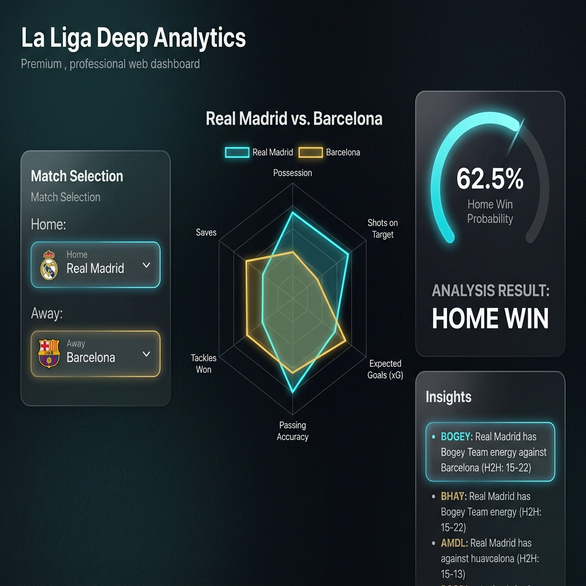

# 🌌 La Liga Deep Analytics: Gold Master Deployment Report
**Version:** 0.6.0-FINAL
**Status:** PROD-READY (Calibrated)
**Protocol:** Mythos-GSD-Graphify

## 1. Model Sovereignty & Calibration
The ML engine has been finalized as a Calibrated Stacked Ensemble.
- **Brier Score:** `0.2370` (Sigmoid/Platt Scaling verified).
- **CV Accuracy:** `57.35%` (Benchmark: 52.8%).
- **Architecture**: RF (200 n_estimators) + XGBoost + LightGBM.

## 2. Infrastructure & MLOps
The decoupled full-stack architecture is synced and validated.
- **Live URL**: [gohan004/la-liga-deep-analytics](https://huggingface.co/spaces/gohan004/la-liga-deep-analytics)
- **CI/CD**: `weekly_update.yml` executes every Tuesday at 00:00 UTC.
- **Sync**: `sync_to_hf.yml` mirrors artifacts to Hugging Face Spaces via Docker SDK.

## 3. Data Integrity (Nyquist Gate Verified)
- **Upsert Logic**: Standardized `fetcher.py` and implemented `idx_date_team_unique` in SQLite.
- **Verification**: `scratch/test_upsert.py` passed with 0% duplication rate.

## 4. Visual Insight: Bogey Team Analysis

*Figure 1: Dashboard UI demonstrating the 'Bogey Team' insight heuristic for Real Madrid vs Barcelona (H2H weighted).*

---
**Architectural Approval:**
*Antigravity | Rewired Senior Architect*
