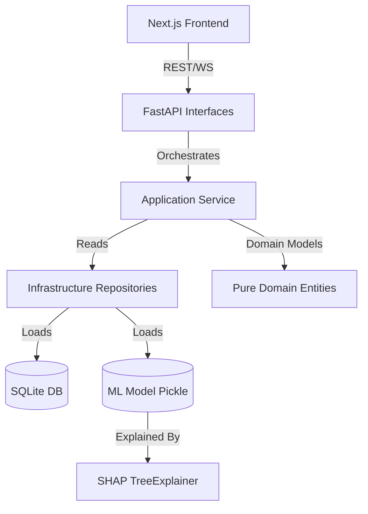

# Tactical Knowledge Map (v0.8.1)

## 🌐 Dependency Graph

## 🗝️ Key Entities & Logic
1. **Model Ensemble**: A soft-voting ensemble of RF, XGB, and LGBM. Calibrated via Sigmoid to ensure predicted probabilities match empirical frequencies.
2. **Feature Engineering**: `rolling_gf`, `rolling_ga`, `h2h_home_wins`, `h2h_away_wins`. Calculated in `src/infrastructure/repositories.py` and modularized in `src/ml_logic.py`.
3. **Live Stream**: WebSocket push at `2s` intervals with simulated probability drift on a `0.52` home-win baseline.

## 🛠️ Operational Commands
- **Backend**: `python -m uvicorn src.interfaces.api:app --host 0.0.0.0 --port 8002`
- **Frontend**: `npm run dev` (Port 3000)
- **Metrics**: `http://localhost:8002/metrics`
